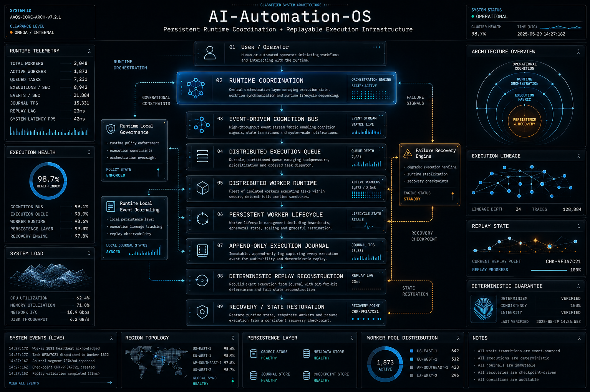

# AI-Automation-OS

AI-Automation-OS is infrastructure for replayable runtime execution, repository cognition, and persistent engineering memory.

The repository is terminal-first and PowerShell-heavy. Most active systems transform one timestamped artifact into another instead of running as long-lived services. That keeps execution inspectable and makes failures easier to replay, but it also means operators must understand artifact ordering.

## What This Is

- Runtime orchestration and coordination infrastructure.
- Replayable execution and recovery tooling.
- Repository-aware engineering cognition experiments.
- Persistent state, memory, telemetry, and architecture records.

## What This Is Not

- A chatbot wrapper.
- A generic app framework.
- A prompt orchestration product.
- A place for architecture rewrites without operational need.

## Core Systems

| System | Location | Responsibility |
|---|---|---|
| Runtime stages | `runtime/` | PowerShell entrypoints and modules that produce runtime artifacts. |
| Event bus | `event-driven-cognition-bus/` | Timestamped cognition events derived from propagation deltas. |
| Execution queue | `distributed-execution-queue/` | Pending runtime work derived from events. |
| Worker lifecycle | `distributed-worker-runtime/`, `persistent-worker-lifecycle/` | Worker execution results and durable worker state. |
| Recovery | `failure-recovery-engine/` | Recovery decisions based on lifecycle and worker state. |
| Journal | `append-only-execution-journal/`, `runtime-local-event-journaling/` | Replayable execution and local event history. |
| Replay | `deterministic-replay-reconstruction/` | Reconstructed execution state from the latest journal artifact. |
| Memory and cognition | `memory/`, `repository-cognition/`, `semantic-cognition/` | Engineering memory, repository structure, and inferred runtime intent. |

There are no root folders named `replay/` or `journal/` today. The active replay and journal systems use explicit subsystem folders.

## Runtime Flow

The current replayable execution path is:

```text
incremental-cognition-propagation
  -> event-driven-cognition-bus
  -> distributed-execution-queue
  -> distributed-worker-runtime
  -> persistent-worker-lifecycle
  -> execution-lifecycle-orchestration
  -> failure-recovery-engine
  -> append-only-execution-journal
  -> deterministic-replay-reconstruction
```

Local governance and local event journaling run alongside that path:

```text
dynamic-governance-policy-engine + execution-governed-consensus
  -> runtime-local-governance
  -> runtime-local-event-journaling
```

## Documentation

- `docs/architecture.md` - repository architecture and subsystem boundaries.
- `docs/runtime-flow.md` - execution flow and artifact handoff model.
- `docs/journal-system.md` - journal responsibilities and risks.
- `docs/replay-system.md` - replay reconstruction behavior and limitations.
- `AI_CONTEXT.md` - compact context for AI coding agents.
- `CURRENT_STATE.md` - current status, risks, and cleanup targets.
- `SYSTEM_OVERVIEW.md` - high-signal map of the repository.

## Operating Rules

- Preserve architecture unless there is a clear operational reason to change it.
- Treat timestamped JSON artifacts as execution history.
- Prefer small, explicit runtime stages over hidden orchestration.
- Do not delete or rewrite generated state unless the task specifically calls for cleanup.
- When changing runtime behavior, document how replay and journaling are affected.

## Current Risks

- Many runtime stages select the newest upstream JSON file independently. If stages are rerun out of order, artifacts can be paired across different execution passes.
- Some lineage fields use generated GUIDs. They are useful for correlation but are not content hashes.
- Several systems are simulation-backed and should not be treated as production telemetry without replacement inputs.
- Empty placeholder runtime files exist and should be clarified before they become dependencies.

## System Architecture



## System Architecture

The runtime architecture focuses on:
- persistent execution coordination
- append-only journaling
- deterministic replay reconstruction
- recovery-oriented runtime orchestration


